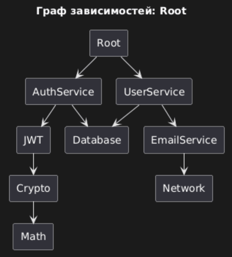

# Проект: Инструмент визуализации графа зависимостей для NuGet пакетов

## 1. Общее описание

Цель практической работы — разработать CLI-инструмент, который:
- анализирует зависимости NuGet пакетов,
- строит полный граф зависимостей (включая транзитивные),
- отображает зависимости в виде ASCII-дерева и PlantUML диаграмм.

Проект реализует **все этапы практической работы (ПР)**:
1. Конфигурация через YAML файл.  
2. Получение данных о зависимостях из NuGet API.  
3. Построение графа зависимостей с помощью DFS (Depth-First Search).  
4. Вычисление порядка загрузки зависимостей (снизу-вверх).  
5. Визуализация в формате PlantUML диаграмм.

Реализация выполнена на Go 1.19+ без использования готовых менеджеров пакетов или библиотек анализа зависимостей.

---

## 2. Описание функций и настроек

### Модуль config

| Файл | Назначение |
|------|-------------|
| `LoadConfig(filename)` | Загружает конфигурацию из YAML файла |
| `PrintParam(cfg)` | Выводит параметры конфигурации |
| `Validate(cfg)` | Валидирует параметры конфигурации |

---

### Модуль nuget

| Файл | Назначение |
|------|-------------|
| `FetchPackageDependencies()` | Получает зависимости из NuGet API |
| `GetNuspec()` | Загружает и парсит .nuspec файл |
| `PrintDependencies()` | Выводит прямые зависимости |

---

### Модуль graph

| Файл | Назначение |
|------|-------------|
| `BuildDependencyGraph()` | Строит граф зависимостей алгоритмом DFS |
| `GetLoadOrder()` | Возвращает порядок загрузки «снизу-вверх» |
| `GeneratePlantUML()` | Генерирует PlantUML диаграмму |
| `CompareWithNuGetTools()` | Сравнивает с штатными инструментами |

---

### Модуль testrepo

| Файл | Назначение |
|------|-------------|
| `LoadTestRepo()` | Загружает тестовый граф из текстового файла |
| `GetDepsFromTestRepo()` | Возвращает зависимости для тестового режима |

---

## 3. Команды для  запуска

# Клонирование репозитория
git clone <https://github.com/F0REST1R/graph>
cd graph

# Запуск
go run main.go

## 4. Пример визуализации зависимостей 

